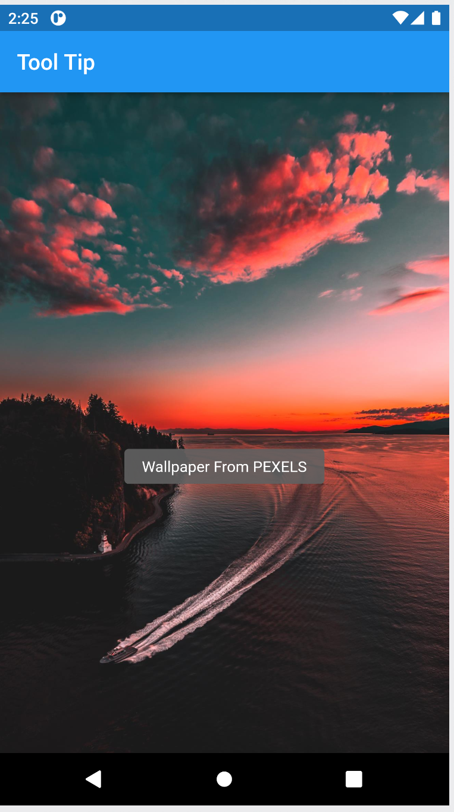

# basic_flutter

## Basic widget
- Screenshot of the Project
  - ### AppBar
    
    
  - ### Column
    - 
    - 
      
  - ### Container
    - 
      
  - ### Elevated Button
    - 
    
  - ### Text Button
    - 
      
  - ### Icons
    - 
      
  - ### Icon Button
    - 
      
  - ### Image
    - 
  
  - ### Visibility
    - 
    - 
  
  - ### DatePicker
    - 
  
  - ### BottomNavigationBar
    - 
  
  - ### PopUpMenu
    - 
  
  - ### Range Slider
    - 
  
  - ### TimePicker
    - 
  
  - ### Wrap
    - 
  
  - ### PageView
    - 
    
  - ### Modal Bottom Sheet
    - 

  - ### Animation Faded
    - 
    
  - ### Expanded
    -  
  - ### Flexible
    - With Fit
      - 
    
    - Without Fit
      - 
      
    - Without Fit And Height
      - 
  - ### Future Builder
    - Without Error
      - 

    - With Error
      - 

    - ### Grid Paper
      - 
    
  - ### Tool Tip
      - 
    
  - ### Spread Operator (...imageList)
      - 

  - ### Stack
      -   
    
  - ### Positioned Under Stack
      -   

  - ### Alert Dialog
      -   

  - ### Table Widget
      - 

  - ### InkWell
      - onTap()
          - 

      - onDoubleTap()
          - 
           
      - onLongPress()
          -  

  - ### Interactive
      - onZoom In()
          - 

      - onZoom Out ()
          -    

      - onWindow ()
          - 

  - ### Table Widget
      - 

  - ### Selectable Text
      - 
  
  