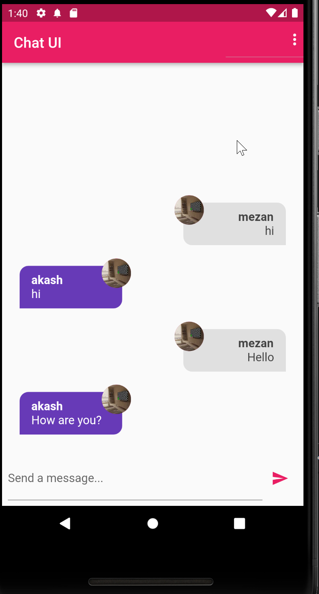
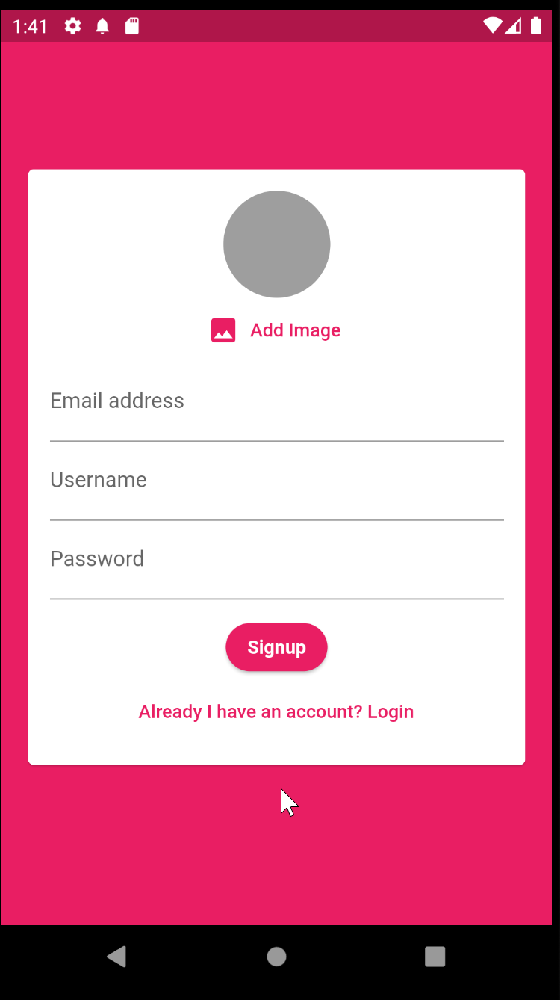

# chat_app

A new Flutter project.

## Getting Started

- Screenshot of the Project
    - Auth Form
        - 
    - Auth Form Validation
        - 
        - 
    - Auth With Firebase SDK
        - 
    - Auth Logout
        - 
    - Chat Screen
        -      
    - Signup Screen
        -   
    - Notification Screen
        -   
        -   